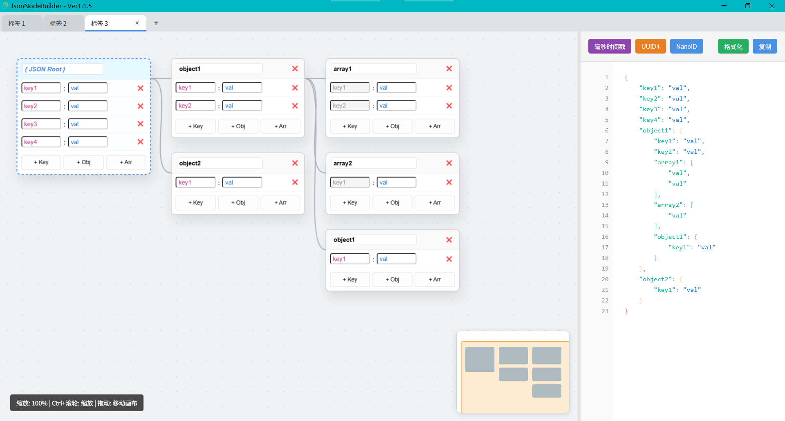

# Visual JSON Builder Pro

<p align="center"><a href="./README.zh-CN.md">中文</a> | English<br></p>

A visual JSON builder built with Tauri + Vanilla JS, featuring a node-based editor with real-time JSON generation.

<p align="center"></p>

## Features

- Visual node editor
- Real-time JSON preview
- Support for nested objects and arrays
- Clean drag-and-drop interaction

## Requirements

- [Node.js](https://nodejs.org/) 18+ (for the Tauri CLI)
- [Rust](https://www.rust-lang.org/) 1.70+ (Tauri backend)
- [System dependencies](https://tauri.app/v1/guides/getting-started/prerequisites) (depending on your OS)

## Getting Started

### 1. Install dependencies

Make sure Rust and Node.js are installed first, then install the Tauri CLI:

```bash
npm install -g @tauri-apps/cli
```

### 2. Run in development mode

```bash
npm run tauri dev
```

Or use the Tauri CLI directly:

```bash
cargo tauri dev
```

### 3. Build the release version

```bash
npm run tauri build
```

The build artifacts will be placed in the `src-tauri/target/release/bundle/` directory.

## License

MIT License
